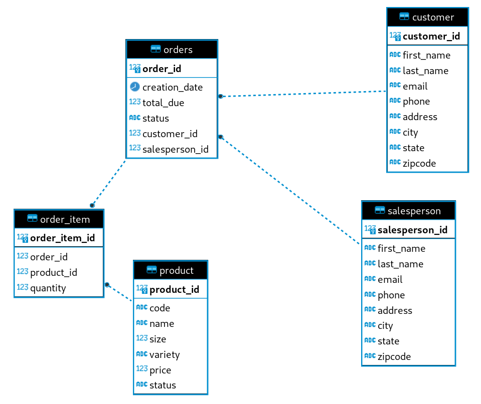

# JDBC Application

## <ins>Introduction
The `JDBC Application` can be used to perform queries using the __Java Database Connectivity__ (JDBC)
on a PostgreSQL database, which contains information on customer's orders from a retail store.
__Create Read Update Delete__ (CRUD) operations were effectively implemented in the design by using
`Data Access Objects` and `Data Transfer Objects`.

__Targeted User:__ The product can be used by any businesses who would like to use a 
database to store all their customer's information. This would allow the business to use simple
queries to effectively view or modify their orders for any given period. 

__Technologies:__
> Git | Java SE 8 | JDBC API | Apache Maven | PostgreSQL 

## <ins> Entity-Relationship Model

## <ins> Design Patterns
The Data Access Object (DAO) pattern was used in the `JDBC Application` for the classes Customer and Order.
By using the DAO pattern, whenever I perform CRUD operations, the actual process of connecting to the database,
passing the query, and returning the result can be taken care of instead of prompting the user
to authenticate each step. The repository design pattern works in a similar way, except 
its more useful in situations where there are large amounts of classes utilizing heavy querying.

## <ins> Test 
I tested the application using sample data in the customer and orders table, and performed some sample 
queries to test if the application is working.
