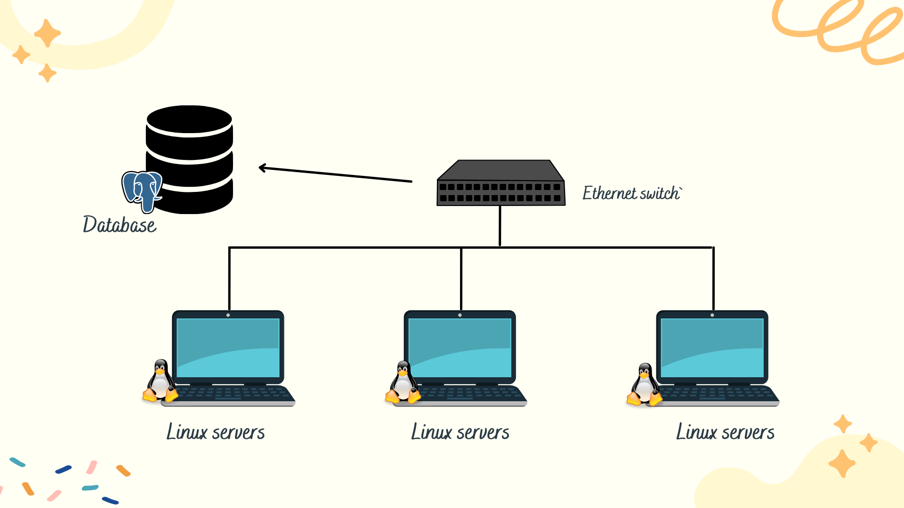

# Jarvis Linux Cluster Monitoring Agent

## Introduction
The _Jarvis Linux Cluster Monitoring Agent_ manages a linux cluster of servers running linux distribution of CentOS 7.
With this set of scripts, users have the ability to gather data on harware information and usage of all servers in the cluster
in one database, compare results and analyze the effective utilization of hardware resources.

__Targeted User:__ The *Linux Cluster Administration Team at Jarvis* would require this product to manage
their 10 CentOS servers which are connected via a network switch. 

__Technologies:__
>Git | Docker | Bash Scripts | Linux [CentOS 7] | PostgreSQL | Google Cloud Platform

## Architecture

## Script Descriptions
- `host_info.sh`: Collect each node's hardware information and stores it in the
database. This script runs only once for each node.
  
- `host_usage.sh`: This bash script will collect resource usage from each node and store it in the 
  database. The script will be automated by `crontab` so it can run every minute.
  
- `psql_docker.sh`: This bash script will run docker to create, start, and stop a container.
    - Name of container: `jrvs-psql`
        - _Default Username: `centos`_
        - _Default Password: `centos1234`_
    
- `ddl.sql`: This sql script will be used to create and define the `host_info` and `host_usage`
tables.
  
- `queries.sql`: This sql script will allow us to test if the program is working.
It will implement the following test cases:
  - __Test Case 1:__ Sort by CPU number, id, and the total memory size in descending order
  - __Test Case 2:__ Sort by average used memory (total memory - free memory) over 5 min intervals in percentage
  - __Test Case 3:__ Detect whether a host failure has occurred on the occasion that `crontab` failed.
    
## Database Elements 
Database `host_agent` will contain the following two tables:

`host_info`:

| id | hostname | cpu_number | cpu_architecture | cpu_model | cpu_mhz | l2_cache | total_mem | timestamp |
| ----- | ----- | ----- | ----- | ----- |----- | ----- | ----- | ----- |
| `Serial`| VARCHAR Unique | INT | VARCHAR | VARCHAR | REAL | INT | INT | YYYY-M-D H:M:S |

| | Description|
|----| -----|
| id | Unique identifier for each node - __Primary key__|
| hostname| Unique host name for each node, it can be obtained by `hostname -f`|
|cpu_number| It will provide information on the number of CPU's in the same server, it can be obtained by `lscpu`|
|cpu_architecture| The type of architecture that the system is based on, it can be obtained by `lscpu`|
|cpu_model| The model of the CPU, it can be obtained by `lscpu`|
|cpu_mhz| The operating frequency of the CPU, it can be obtained by `lscpu`|
|l2_cache| It will provide information on the process and the memory performance gap, it can be obtained by `lscpu`|
|totalmem| It will provide information regarding the total memory of the system, it can be obtained by `lscpu`|
|timestamp| It will provide the date and time the data was captured|

`host_usage`:

| timestamp | host_id | memory_free | cpu_idle | cpu_kernel | disk_io | disk_available | 
| ----- | ----- | ----- | ----- | ----- | ----- | ----- | 
| YYYY-M-D H:M:S| `Serial` | REAL | INT | INT | INT | REAL | 

| | Description|
|----| -----|
| timestamp | It will provide the date and time the data was captured|
| host_id | Unique id for each node - __Foreign key__|
|memory_free| It will provide information on memory that is available for use, it can be obtained by `vmstat`|
|cpu_idle| It will provide information on the amount of time the processor is not being used by any program in percentage, it can be obtained by `vmstat`|
|cpu_kernel| It will provide information on the current running tasks in the CPU, it can be obtained by `vmstat`|
|disk_io| It will provide information on the input and output processes happening in the CPU, it can be obtained by `vmstat`|
|disk_available| It will provide information on the amount of disk space available, it can be obtained by `df -BM`|

## Product Usage
Follow these steps to understand how to use the product. 

1. Create PSQL docker container 
>    ./linux_sql/scripts/psql_docker.sh create_centos_centos1234

2.  Set up the database and `host_info` and `host_usage` tables 
>   psql -h psql_host -U psql_user -W -d psql_database -f linux_sql/sql/ddl.sql

3. `host_info` will only be required to run once, it will collect all the computer's hardware data. Note mypassword = password.
>   host_info.sh "localhost" 5432 "host_agent" "postgres" "mypassword"

4. To obtain instantaneous value for `host_usage` of current node, enter the following: Note mypassword = password.
>  host_info.sh "localhost" 5432 "host_agent" "postgres" "mypassword"

5. To automate `host_usage`, enter the following in crontab:
>   export PGPASSWORD='password' 

>  ./linux_sql/scripts/host_usage.sh "localhost" 5432 "host_agent" "postgres" "password" 

## Improvements
- With the `host_info.sh` script running only once, if the user updates their computer by 
increasing total memory capacity for example, the change would not be reflected onto the
database. A potential solution would be to find a way to run the script every month automatically.
  
- If there are any technical error in the parent node that hosts the database, a backup storage
feature would be helpful so that the data would not be lost.
  
- With `host_usage.sh` running every minute, storage would soon become a problem if the 
product was left on for too long. A potential solution could involve analyzing and summarizing
the data every couple of hours. 
